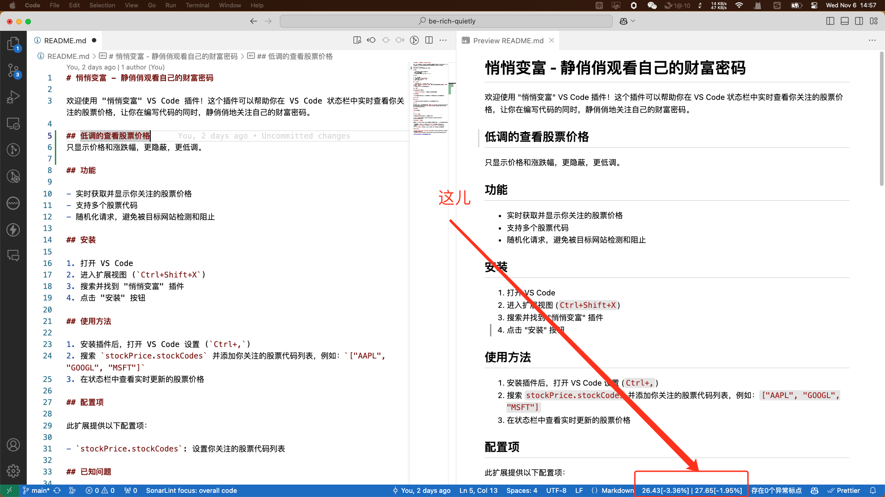

# 悄悄变富 - 静俏俏观看自己的财富密码

欢迎使用 "悄悄变富" VS Code 插件！这个插件可以帮助你在 VS Code 状态栏中实时查看你关注的股票价格，让你在编写代码的同时，静俏俏地关注自己的财富密码。

## 低调的查看股票价格
只显示价格和涨跌幅，更隐蔽，更低调。

## 功能

- 实时获取并显示你关注的股票价格
- 支持多个股票代码
- 随机化请求，避免被目标网站检测和阻止

## 安装

1. 打开 VS Code
2. 进入扩展视图 (`Ctrl+Shift+X`)
3. 搜索并找到 "悄悄变富" 插件
4. 点击 "安装" 按钮

## 使用方法

1. 安装插件后，打开 VS Code 设置 (`Ctrl+,`)
2. 搜索 `stockPrice.stockCodes` 并添加你关注的股票代码列表，例如：`["AAPL", "GOOGL", "MSFT"]`
3. 在状态栏中查看实时更新的股票价格

## 配置项

此扩展提供以下配置项：

- `stockPrice.stockCodes`: 设置你关注的股票代码列表

## 已知问题

- 某些情况下，可能会由于网络问题或目标网站的防护机制导致请求失败。

## 发行说明

### 1.0.0

- 初始版本发布，支持实时获取并显示多个股票代码的价格。

## 贡献

如果你有任何建议或发现了问题，欢迎提交 [Issue](https://github.com/shixiaoquan/be-rich-quietly/issues) 或 [Pull Request](https://github.com/shixiaoquan/be-rich-quietly/pulls)。

## 许可证

[MIT](LICENSE)

---

**享受编程的乐趣，同时静俏俏地变富！**